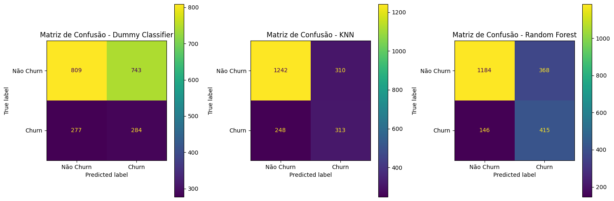

# 📊 Previsão de Churn de Clientes - Análise de Dados e Modelagem Preditiva

## 🎯 Objetivo

Este projeto tem como objetivo principal **prever a evasão de clientes (churn)** com base em variáveis contratuais, de comportamento e serviço. A ideia é identificar padrões e fatores que influenciam a saída dos clientes, oferecendo assim **insights estratégicos para retenção** e **modelos preditivos eficazes**.

---

## 📁 Estrutura do Projeto

├── ML/

│ └── modelos_ml.ipynb # Notebook principal com toda a análise e modelagem

│ └── requirements.txt # requisitos para rodar o notebook

├── dataset/

│ └── Telecom_X_Data_Normalized.csv # Dados tratados, normalizados e quase prontos para modelagem

├── img/

│ └── *.png # Gráficos e visualizações geradas durante a análise

├── README.md # Este arquivo


---

## ⚙️ Preparação dos Dados

### 🛠️ Etapas de tratamento dos dados

1. **Normalização e Padronização**: transformei as variáveis categóricas de sim e não em números binários.
2. **Codificação de variáveis categóricas**: utilizei `OneHotEncoder` para transformar as variáveis não-numéricas.
3. **Balanceamento das classes**: como a evasão é uma classe minoritária, apliquei **balanceamento apenas no conjunto de treino**, preservando a realidade no teste.
4. **Separação dos dados**:
   - **Treino e teste** com proporção 70/30.
   - O conjunto de teste **não foi balanceado**, para manter uma avaliação realista.

---

## 📊 Análise Exploratória (EDA) e Insights

### Fatores com **correlação positiva** com a evasão:
- **Contrato mensal**: mais flexível, menos fidelização.
- **Fibra óptica**: pode estar associado a problemas de qualidade.
- **Pagamento eletrônico**: leve tendência à evasão.

### Fatores com **correlação negativa**:
- **Presença de parceiros ou dependentes**.
- **Ausência de serviço de internet**.
- **Contratos longos (2 anos)**.
- **Tempo na empresa (tenure)**.

### 📈 Métricas visuais geradas:
- Gráficos de barra comparando churn com as variáveis mais relevantes na correlação.
#### Correlação positiva


#### Correlação negativa


- Boxplots para `charges.Total` e `tenure`, evidenciando diferenças entre clientes que evadiram e os que permaneceram.


- Matriz de Confusão de todos os modelos.



As imagens estão organizadas na pasta `img/`.

---

## 🧠 Modelagem e Avaliação

### Modelos aplicados:

| Modelo                   | Acurácia | F1-score (Churn) | Observações |
|--------------------------|----------|------------------|-------------|
| KNN original             | 74%      | 0.53             | Modelo não otimizado, baixo recall. |
| KNN com hiperparâmetros  | 75%      | 0.51             | Leve melhoria, ainda fraco para churn. |
| Random Forest padrão     | 76%      | 0.62             | Boa performance, mesmo sem ajustes. |
| RF com hiperparâmetros   | 77%      | 0.60             | Leve melhora, melhor equilíbrio geral. |
| RF com seleção de features | 72%   | 0.60             | Perde acurácia geral, melhora recall da classe minoritária. |

### Justificativas para decisões:

- **Random Forest superou KNN** em todos os cenários.
- O uso de apenas as features mais importantes **prejudicou a acurácia geral**, pois perdeu-se contexto.
- Métricas como **f1-score e recall foram priorizadas**, pois o foco é detectar corretamente os clientes que **vão sair** (classe minoritária).

---

## 💡 Estratégias de Retenção Propostas

1. **Reformulação dos contratos mensais**: incentivar planos de longo prazo.
2. **Melhoria do serviço de internet (fibra óptica)**: foco em qualidade e suporte.
3. **Fidelização de clientes antigos**: programas de benefício por tempo de casa.
4. **Ofertas personalizadas para famílias**: atrair perfis com maior permanência.
5. **Onboarding estratégico nos primeiros meses**: atuar no momento mais crítico de churn.

---

### 📦 Requisitos

Disponíveis em requirements.txt.

```bash
pip install -r ML/requirements.txt
# ou
pip3 install -r ML/requirements.txt


